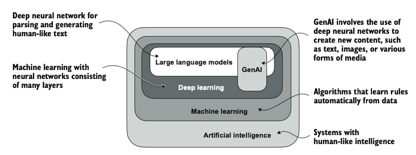
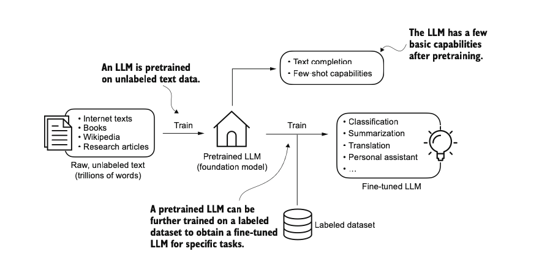

# Chapter 01

The chapter 01 in the book explains about the definitions of LLM.

## Keypoints (in my own words)

- Large Language Model succeed because of transformer architecture. Not all LLM are built on top of transformer architecture.
- The word "large" in LLM is just to show the size of LLM

## About LLM and Deep Learning

## Application of LLM

- This chapter explains about LLM capabilities, like text generation, content creation, context understanding.

## Stages of building and using LLM

- Most LLMs developed using PyTorch.
- Explains about the benefits of developing our own LLM, either building from scratch or fine-tuning existing LLM model to our own domain-specific task.
- Local LLM benefits the user low latency.

To oversimplify the process of developing LLM, first we gather data (tons of data), and then we train it (pretraining), resulting as pretrained base model. But the base model has limited capabilities, only like text completion. We need to train it again with labeled dataset. For example, if you want to make the model to be able to classify object, e.g. a car, you need to have a dataset that contains the image of object (car) and the label of the image ("car"), with thousands row of it. After that, the model should be able to classify an image of cars.

## Transformer Architecture

