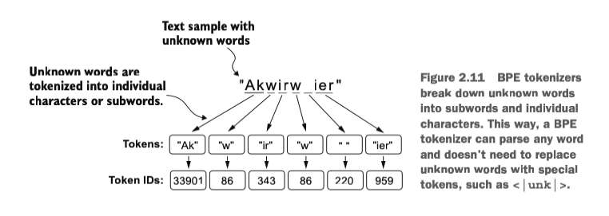

# Chapter 02


## Embeddings

- There are many kind of text embeddings: **word embeddings**, **sentence embeddings**, **paragraph embeddings**, and **whole document embeddings**. 
- *Retrieval-augmented generation* (RAG) is using sentence embeddings to retrieve data from given knowledge base.
- The most popular embedding method is using Word2Vec
- Word2Vec embedding convert word to numerical representation. If embeddings are two-dimensional, words with similar concepts are closer to each other, e.g. "apple", "oranges", and "strawberry" will be closer to each other and far from the word "Indonesia".
- High-dimensional embeddings are hard to grasp because human brain is limited to perceive three-dimension or fewer.
- Smallest GPT-2 model (117M and 125M) is using 768 dimension of embeddings. Meanwhile GPT-3 model (175B) is using 12288 dimensions.


## Tokenizer

- Input text are converted to tokens. To put it simply, each word has its own id.
- Tokens example: 
```
(token_name, id)
======================
('!', 0)
('"', 1)
("'", 2)
('(', 3)
(')', 4)
(',', 5)
('--', 6)
('.', 7)
(':', 8)
(';', 9)
('?', 10)
('A', 11)
('Ah', 12)
('Among', 13)
('And', 14)
```

- When converting a text into tokens, it converts into array of tokens. For example:

```
text = "It's the last he painted, you know,"
ids = tokenizer.encode(text)
print(ids)
// [56, 2, 850, 988, 602, 533, 746, 5, 1126, 596, 5]
```

## Special Tokens

Researchers add special token to mark a point in text or to represent something, which are:
- `<|endoftext|>` token added to mark the end of the document. Useful when concatenating two unrelated text.
- `<|unk|>` token added to represent unknown token in the vocabulary.
- `[BOS]` (*beginning of sequence*) this token marks the start of a text.
- `[EOS]` (*end of sequence*) this token marks the end of a text. Same like `<|endoftext|>`
- `[PAD]` (*padding*) when training LLM, if you have two batch that contains different size of length, we need to make the length equal by making the shorter text to be longer by filling it with `[PAD]`.

Note: GPT models don't use any of these token. Instead, they use *byte-pair encoding* tokenizer, which breaks words down into subword unit.

## Byte-pair Encoding

We will use [tiktoken](https://github.com/openai/tiktoken) byte-pair encoding (BPE).

Unlike our SimpleTokenizer, tiktoken can encode and decode any unknown words. Instead of just changing it into something like `<|unk|>`, tiktoken breaks down unknown word into subwords and characters. Look at this example: 



