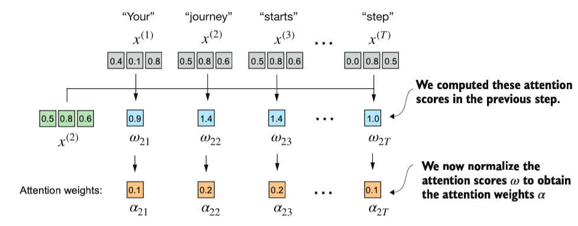

## Recurrent neural networks (RNN) 

Before the transformers, RNN (recurrent neural network) was the most popular neural network that use encoder-decoder architecture.

How RNN works:
- The previous output is fed as the input in the next step.
- It's suitable for sequential data (like stock market price)
- RNN was the popular choice for machine translation.
- Disadvantage: RNN will gradually loss of context if the data is long or complex, so RNN only works fine if the text is short.


## Attention Mechanism

Note: this Attention Mechanism needs focus to understand it.

### Definition

Self-attention allows an element to have a connection with other elements, by calculating the relevancy between the element and any other element in a sequence.

"Self" in self-attention means the ability to compute the relationship between different parts of a sequence.


### Attention Weights

The first step implementing self-attention is to compute the attention scores, referred as ω.

Attention weights (or attention scores) are calculated by using dot product of the two elements' embedding. 

For example, if we have this simple embeddings:

```py
inputs = torch.tensor(
    [[0.43, 0.15, 0.89], # Your     (x^1)
     [0.55, 0.87, 0.66], # journey  (x^2)
     [0.57, 0.85, 0.64], # starts   (x^3) 
     [0.22, 0.58, 0.33], # with     (x^4)
     [0.77, 0.25, 0.10], # one      (x^5)
     [0.05, 0.80, 0.55]] # step     (x^6)
)
```

If we want to calculate the attention scores ω between the x^2 and every other input elements, we calculate the dot product of x^2 embeddings to x^n.

For example, the attention score between x^1 ("your") and x^2 ("journey"), we can dot product like this:

```py
score = inputs[0].dot(inputs[1]) # output: tensor([0.9544])

# equal to

score = 0.43 * 0.55 + 0.15 * 0.87 + 0.89 * 0.66 # output: tensor([0.9544])
```

To make it more simple, we can loop it. This example below shows how to get attention scores between x^2 and every other elements.

```py
query = inputs[1]
attn_scores_2 = torch.empty(inputs.shape[0]) # create empty tensor with `vocab_size` sized 
for i, embed in enumerate(inputs):
    attn_scores_2[i] = query.dot(embed) # or torch.dot(embed, query)
print(attn_scores_2)

# Output: tensor([0.9544, 1.4950, 1.4754, 0.8434, 0.7070, 1.0865])
```

#### Normalize the attention weights

Now we normalize the attention weights to obtain a number that sum up to 1. Useful for interpretation and maintaining training stability.

In below image, there are symbols:

- $\omega_{xy}$ contains the dot product of `inputs[x]` and `inputs[y]` 
- $\alpha_{xy}$ contains the normalized number of $\omega_{xy}$




```py
attn_weights_2_tmp = attn_scores_2 / attn_scores_2.sum()
print("Attention weights:", attn_weights_2_tmp)
print("Sum:", attn_weights_2_tmp.sum()) # this will output 1

# Output: 
# Attention weights: tensor([0.1455, 0.2278, 0.2249, 0.1285, 0.1077, 0.1656])
# Sum: tensor(1.0000)
```

Usually it's advisable to use softmax (`torch.softmax`) function for normalization. But this way is better to manage extreme values and better gradient properties during training.


### Getting Context Vectors


Before computing attention scores, we already have weights for each element in a sentence. After that, we compute the attention scores.

1. Compute Attention Scores

Attention score is a score between two element by getting the dot product between two element's embeddings. To get each elements' attention score to each element, we can do dot product for each of them and be N x N matrix where N is number of elements.

Code to get it:
```py
attn_scores = torch.empty(6, 6) # assume the input element count is 6
for i, x_i in enumerate(inputs):
    for j, x_j in enumerate(inputs):
        attn_scores[i, j] = torch.dot(x_i, x_j)
print(attn_scores)
```

simplified version:
```py
attn_scores = inputs @ inputs.T
```

Here, `@`  is matrix multiplication.

2. Compute Attention Weight

After we got the matrix result:

```py
tensor([[0.9995, 0.9544, 0.9422, 0.4753, 0.4576, 0.6310],
        [0.9544, 1.4950, 1.4754, 0.8434, 0.7070, 1.0865],
        [0.9422, 1.4754, 1.4570, 0.8296, 0.7154, 1.0605],
        [0.4753, 0.8434, 0.8296, 0.4937, 0.3474, 0.6565],
        [0.4576, 0.7070, 0.7154, 0.3474, 0.6654, 0.2935],
        [0.6310, 1.0865, 1.0605, 0.6565, 0.2935, 0.9450]])
```

Now we compute attention weight by normalizing it using softmax.

```py
attn_weights = torch.softmax(attn_scores, dim=1)
print(attn_weights)
```

The `dim=-1` means we calculate the softmax from the last dimension. Here, the dimension is `[rows, columns]`, so it means we are softmaxing the column (if we sum each row it will sum up to 1).

Normalizing using softmax is to get the probability distribution.

```
tensor([[0.2098, 0.2006, 0.1981, 0.1242, 0.1220, 0.1452],
        [0.1385, 0.2379, 0.2333, 0.1240, 0.1082, 0.1581],
        [0.1390, 0.2369, 0.2326, 0.1242, 0.1108, 0.1565],
        [0.1435, 0.2074, 0.2046, 0.1462, 0.1263, 0.1720],
        [0.1526, 0.1958, 0.1975, 0.1367, 0.1879, 0.1295],
        [0.1385, 0.2184, 0.2128, 0.1420, 0.0988, 0.1896]])
```

3. Compute Context Vectors

After we got the attention weight, we multiply back with original input embeddings.

```py
all_context_vecs = attn_weights @ inputs
print(all_context_vecs)
```