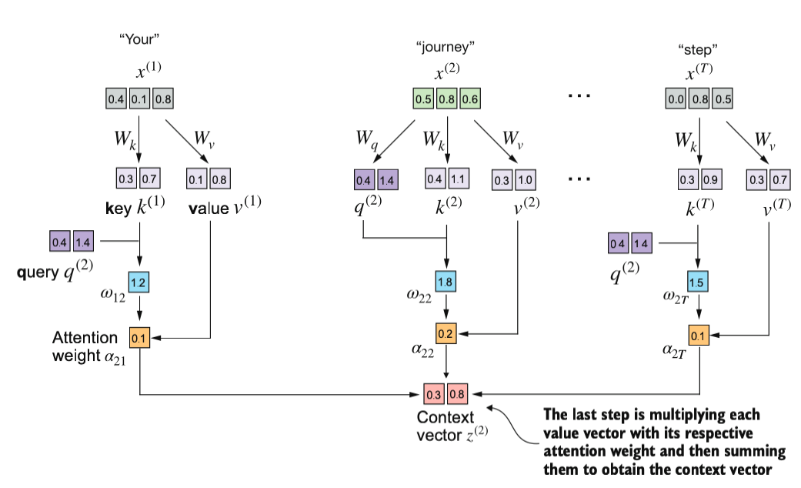

## Apa itu context vector?

Jadi, masing-masing token dalam input sequence itu punya context vectornya masing-masing.

Contohnya input ini:
```py
inputs = torch.tensor(
    [[0.43, 0.15, 0.89], # Your     (x^1)
     [0.55, 0.87, 0.66], # journey  (x^2)
     [0.57, 0.85, 0.64], # starts   (x^3) 
     [0.22, 0.58, 0.33], # with     (x^4)
     [0.77, 0.25, 0.10], # one      (x^5)
     [0.05, 0.80, 0.55]] # step     (x*6)
)
```

Akan punya context vector ini:

```
tensor([[0.2997, 0.8094],
        [0.3067, 0.8265],
        [0.3063, 0.8256],
        [0.2947, 0.7960],
        [0.2925, 0.7900],
        [0.2991, 0.8077]], grad_fn=<MmBackward0>)
```

Sebagai contoh, mari kita lihat cara kerja mendapatkan context vector untuk `input[1]`:



### Definisi context vector

Context vector itu adalah kombinasi (multiplikasi) antara value yang merepresentasikan seberapa pentingnya sebuah token dengan token lainnya dalam sebuah sequence.