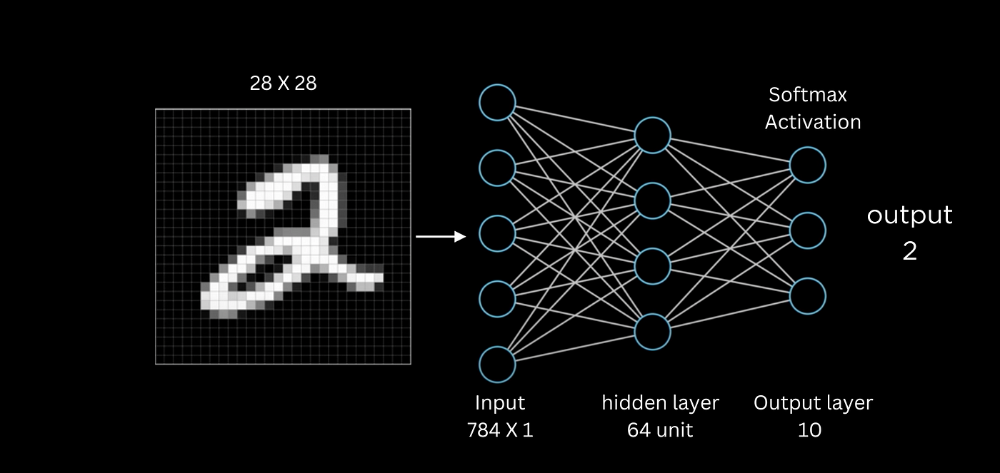

# Basic Neural Network

We'll use MNIST handwritten digit example to create neural network to classify number image. The output expectation is the actual correct number.

Below code is generated by Gemini as an example.

```py
import torch
import torch.nn as nn
import torch.optim as optim
import torchvision
import torchvision.transforms as transforms
from torch.utils.data import DataLoader

# 1. Define the Model
class SimpleNN(nn.Module):
    def __init__(self):
        super(SimpleNN, self).__init__()
        self.flatten = nn.Flatten()  # Flatten the 28x28 image to a 784-dimensional vector
        self.linear1 = nn.Linear(784, 64)  # Input: 784, Output: 64
        self.relu = nn.ReLU()
        self.linear2 = nn.Linear(64, 10)   # Input: 64, Output: 10 (digits 0-9)

    def forward(self, x):
        x = self.flatten(x)
        x = self.linear1(x)
        x = self.relu(x)
        x = self.linear2(x)
        return x

# 2. Load the MNIST Dataset
transform = transforms.Compose([
    transforms.ToTensor(),  # Converts images to PyTorch tensors
    transforms.Normalize((0.5,), (0.5,))  # Normalizes pixel values to be between -1 and 1
])

train_dataset = torchvision.datasets.MNIST(root='./data', train=True, download=True, transform=transform)
test_dataset = torchvision.datasets.MNIST(root='./data', train=False, download=True, transform=transform)

train_loader = DataLoader(train_dataset, batch_size=64, shuffle=True)
test_loader = DataLoader(test_dataset, batch_size=64, shuffle=False)


# 3. Instantiate the Model, Loss Function, and Optimizer
model = SimpleNN()
criterion = nn.CrossEntropyLoss()  # For multi-class classification
optimizer = optim.Adam(model.parameters(), lr=0.001) # Adam optimizer


# 4. Training Loop
num_epochs = 3  # Adjust as needed

for epoch in range(num_epochs):
    running_loss = 0.0
    for i, data in enumerate(train_loader, 0):
        inputs, labels = data  # Unpack data and labels

        optimizer.zero_grad()  # Zero the parameter gradients

        outputs = model(inputs)  # Forward pass: compute predicted outputs
        loss = criterion(outputs, labels)  # Compute the loss
        loss.backward()  # Backward pass: compute gradient of the loss with respect to model parameters
        optimizer.step()  # Optimization step: update the model parameters

        running_loss += loss.item()
        if i % 200 == 199:    # Print every 200 mini-batches
            print(f'[{epoch + 1}, {i + 1:5d}] loss: {running_loss / 200:.3f}')
            running_loss = 0.0

print('Finished Training')

```

In this `SimpleNN` class, we have two layers, `linear1` and `linear2`. We have basic forward pass which contains:

- Input `x` with size (784, 1)
- We do a linear transformation to transform input with size 784 to 64. This is initially set with `nn.Linear(in_features=784, out_features=64)`.
- After the linear transformation, we created a hidden layer with size (64, 1)
- We do once more linear transformation to transform the hidden layer from (64, 1) to (10, 1), which is the output, ranging from 0-9.
- Between 0-9, the highest score is the output.




## My questions:

### What is `nn.Linear`?

`nn.Linear` is a class that implements linear transformation. It accepts input (in this case, `x`). And then it applies linear transformation like this:

$$
y = x * W^T + b
$$

Explanation for each letter:

- $y$ is the output tensor. The shape is (out_features)
- $x$ is the input tensor. The shape is (in_features)
- $W$ is the weight matrix and $W^T$ is the weight matrix transposed. Why transposed? Because we need it for matrix multiplication. The shape is (in_features, out_features). Initially generated by Pytorch using Kaiming Initialization.
- $b$ is the bias. Initially the value is 0. 

The weights and bias value will be pdated dring training sing gradients calculated via backpropagation.


### Why should we use ReLU?